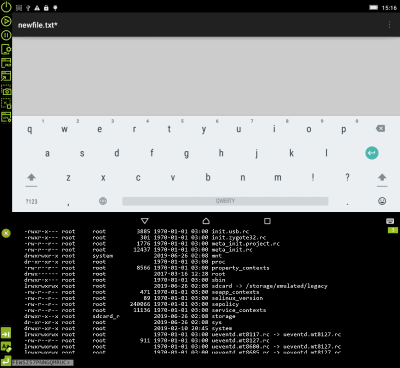

# ADB Android Viewer

> Android remote Viewer 
developed to view and control your android device from a PC.

> ADB exchange Android Viewer, support scale view, input tap from mouse, input swipe from keyboard, more features..

ADB Android Viewer is a graphical application that displays the screen of a mobile device with the ability to control. Support for large-scale viewing, touch input with the mouse, flipping through keyboard input, screenshots, device selection, ADB manager management, and other functions ..  
Description and screenshots: [EN](https://clnviewer.github.io/Code-Blocks-Android-NDK/ADBANDROIDVIEWER.EN.html) | [RU](https://clnviewer.github.io/Code-Blocks-Android-NDK/ADBANDROIDVIEWER.RU.html)  

Main characteristics:
   - uses ADB to access the device
   - supports devices with Android versions from `5.x` to` 9.x` and `Android API` from` 20` version
   - access and receipt of images made through their own drivers temporarily copied to the device
   - supports [configuration file] (https://github.com/ClnViewer/ADB-Android-Viewer/blob/master/src/ADBViewer/ADBViewer.ini) with basic interface settings
   - built-in terminal for access to console commands of a remote device
   - support [scripts `LUA`] (https://github.com/ClnViewer/ADB-Android-Viewer/blob/master/src/ADBViewer/src/App/plugin/plugin-lua/plugin-lua.lua.example  ) for interactive interaction with the device and applications on it
   - integrated graphic [editor / generator] (https://clnviewer.github.io/Code-Blocks-Android-NDK/ADBANDROIDVIEWER.EN.html) of the `LUA` scripts
   - system of loadable [plug-ins] (https://github.com/ClnViewer/ADB-Android-Viewer/tree/master/src/ADBViewer/src/App/plugin/plugin-template), the LUA control plugin is included in the assembled package  `scripts
   - mode of displaying absolute coordinates both in pixels and positions in the video buffer
   - save screenshots in `.bmp` or` .png` formats
   - the ability to copy the device screen to the clipboard
   - GUI supports languages: `Russian`,` English`, `German`,` Chinese`
   - a set of typical Android commands for quick access from the menu
   - install APK packages
 - Device Screen:
   - full screen mode
   - scaling `1: 1` -` 1: 2`
   - mirror reflection
 - Navigation:
   - mouse click is converted to a click on the device
   - the alphanumeric keyboard is converted to pressing system keys, including text input
   - a separate editable text input field that supports copying and pasting text
   - keys `Up`,` Down`, `Left`,` Right` are used to move the screen (swipe)
   - input in national languages ​​is not supported by ADB
 - Built-in terminal:
   - supports the console terminal mode on the remote device
   - editable text input field, copy and paste text, command history
   - keys `Up`,` Down`, used to select from the history of entered commands
   - the keys `PgUp`,` PgDown` are used to scroll the screen
   - the `Tab` key is used to iterate through pre-defined shortcut commands
   - adjustable indent from the bottom edge of the screen when opening the terminal
   
   
Requirements and compatibility

 - you need a smartphone / tablet running on Android with version `4.1.1` and higher
 - minimally supported `Android API` from` 20` version
 - uses as a driver [AScreencap] (https://github.com/ClnViewer/Android-fast-screen-capture)
 - work on Android versions `5.1.1`,` 6.1.1`, `8.0.1`,` 9.1.0` has been checked
 - used third-party libraries: `SDL2 32bit`,` LUA 5.35 32bit`
 - currently available ready assembly under `Windows 10 32bit` in [MSI] archive format (https://clnviewer.github.io/ADB-Android-Viewer/dist/Android-ADB-Viewer.msi)

 ## License

  _MIT_

## Возможности

- Основные характеристики:
  - использует ADB для доступа к устройству  
  - поддерживает устройства с версиями Android от `5.x` до `9.x` и `Android API` от `20` версии  
  - доступ и получение изображения производиться через собственные драйвера временно копируемые на устройство  
  - поддерживает [конфигурационный файл](https://github.com/ClnViewer/ADB-Android-Viewer/blob/master/src/ADBViewer/ADBViewer.ini) с основными настройками интерфейса  
  - встроенный терминал для доступа к консольным командам удаленного устройства  
  - поддержка [скриптов `LUA`](https://github.com/ClnViewer/ADB-Android-Viewer/blob/master/src/ADBViewer/src/App/plugin/plugin-lua/plugin-lua.lua.example) для интерактивного взаимодействия с устройством и приложениями на нем  
  - встроенный графический [редактор/генератор](https://clnviewer.github.io/Code-Blocks-Android-NDK/ADBANDROIDVIEWER.EN.html) скриптов `LUA`  
  - система подгружаемых [плагинов](https://github.com/ClnViewer/ADB-Android-Viewer/tree/master/src/ADBViewer/src/App/plugin/plugin-template), в собранный пакет включен плагин управления `LUA` скриптами  
  - режим отображения абсолютных координат как в пикселях, так и позиции в видео буфере  
  - сохранение скриншотов в форматах `.bmp` или `.png`  
  - возможность копировать экран устройства в буфер обмена  
  - графический интерфейс поддерживает языки: `Russian`, `English`, `German`, `Chinese`  
  - набор типовых команд Android для быстрого вызова из меню  
  - установка APK пакетов  
- Экран устройства:
  - полноэкранный режим  
  - маштабирование `1:1` - `1:2`  
  - зеркальное отображение  
- Навигация:
  - клик мыши преобразуется в клик на устройстве  
  - буквенно-цифровая клавиатура преобразуется в нажатие системных ключей, включая ввод текста  
  - отдельное редактируемое поле ввода текста, поодерживает копирование и вставку текста  
  - клавиши `Up`, `Down`, `Left`, `Right` используются для движения экрана (swipe)  
  - ввод на национальных языках не поддерживается ADB  
- Встроенный терминал:
  - поддерживает режим консольного терминала на удаленном устройстве  
  - редактируемое поле ввода текста, поодерживает копирование и вставку текста, историю команд  
  - клавиши `Up`, `Down`, используются для выбора из истории введенных команд  
  - клавиши `PgUp`, `PgDown` используются для прокрутки экрана  
  - клавиша `Tab` используются для последовательного перебора заранее заданных команд быстрого доступа  
  - настраеваемый отступ от нижнего края экрана при открытии терминала  

## Требования и совместимость

- необходим смартфон/планшет, работающий на Android с версией `4.1.1` и выше  
- минимально поддерживаемое `Android API` от `20` версии  
- использует в качестве драйвера [AScreencap](https://github.com/ClnViewer/Android-fast-screen-capture)  
- проверена работа на версиях Android `5.1.1`, `6.1.1`, `8.0.1`, `9.1.0`  
- используемые сторонние библиотеки: `SDL2 32bit`, `LUA 5.35 32bit`  
- на текущий момент доступна готовая сборка под `Windows 10 32bit` в формате архива [MSI](https://clnviewer.github.io/ADB-Android-Viewer/dist/Android-ADB-Viewer.msi)  

## License

 _MIT_

