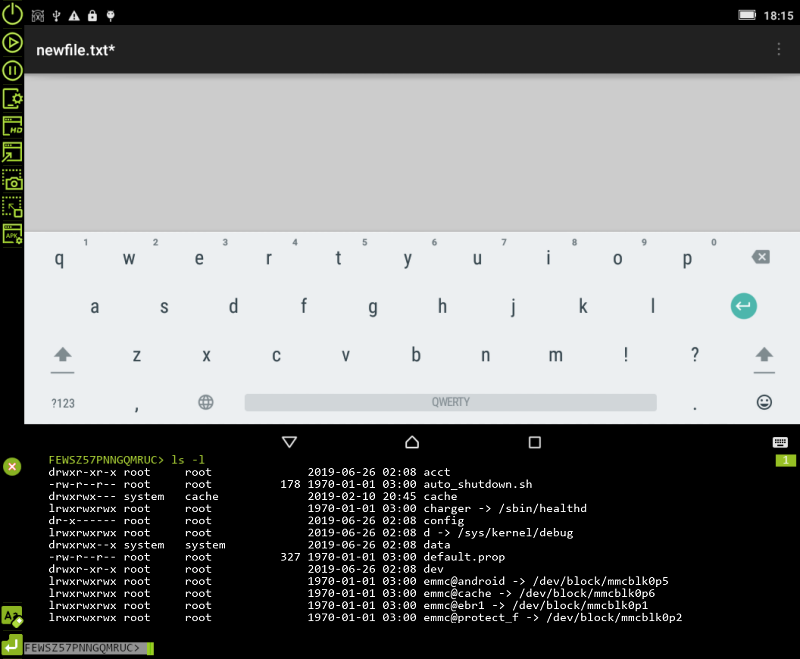

# ADB Android Viewer

> Android remote Viewer 
developed to view and control your android device from a PC.

> ADB exchange Android Viewer, support scale view, input tap from mouse, input swipe from keyboard, more features..

ADB Android Viewer - графическое приложение отображающее экран мобильного устройства с возможностью управления. Поддержка масштабного просмотра, ввод касания с помощью мыши, пролистывание ввода с клавиатуры, скриншоты, выбор устройств, управление АДБ менеджером и другие функции ..  
Описание и скриншоты: [EN](https://clnviewer.github.io/Code-Blocks-Android-NDK/ADBANDROIDVIEWER.EN.html) | [RU](https://clnviewer.github.io/Code-Blocks-Android-NDK/ADBANDROIDVIEWER.RU.html)  

### Возможности
- Основные характеристики:
  - использует ADB для доступа к устройству  
  - доступ и получение изображения производиться через собственные драйвера временно копируемые на устройство  
  - поддерживает конфигурационный файл с основными настройками интерфейса  
  - встроенный терминал для доступа к консольным командам удаленного устройства  
- Экран устройства:
  - маштабирование `1:1` - `1:2`  
  - зеркальное отображение  
- Навигация:
  - клик мыши преобразуется в клик на устройстве  
  - буквенно-цифровая клавиатура преобразуется в нажатие системных ключей, включая ввод текста  
  - отдельное редактируемое поле ввода текста, поодерживает копирование и вставку текста  
  - клавиши `Up`, `Down`, `Left`, `Right` используются для движения экрана (swipe)  
  - ввод на национальных языках не поддерживается ADB  
- Встроенный терминал:
  - поддерживает режим консольного терминала на удаленном устройстве  
  - редактируемое поле ввода текста, поодерживает копирование и вставку текста, историю команд  
  - клавиши `Up`, `Down`, используются для выбора из истории введенных команд  
  - клавиши `PgUp`, `PgDown` используются для прокрутки экрана  
  - клавиша `Tab` используются для последовательного перебора заранее заданных команд быстрого доступа  

### Требования и совместимость

- необходим смартфон/планшет, работающий на Android с версией `4.1.1` и выше  
- минимально поддерживаемое Android API `20`  
- использует в качестве драйвера [AScreencap](https://github.com/ClnViewer/Android-fast-screen-capture)  
- проверена работа на версиях Android `5.1.1`, `6.1.1`, `8.0.1`, `9.1.0`  
- используемые сторонние библиотеки: `SDL2 32bit`, `LUA 5.35 32bit`  
- на текущий момент доступна готовая сборка под `Windows 10 32bit` в формате архива [MSI](https://clnviewer.github.io/ADB-Android-Viewer/dist/Android-ADB-Viewer.msi)  

## License

 _MIT_

