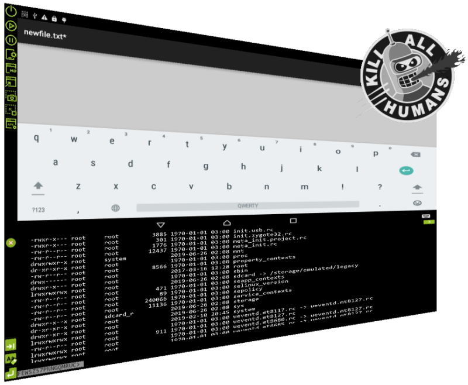

# ADB Android Viewer

> Android remote Viewer developed to view and control your android device from a PC.

>[`ADB Android Viewer` installer](https://clnviewer.github.io/ADB-Android-Viewer/dist/Android-ADB-Viewer.msi) `Bender Rodriguez edition :)`   
> ADB exchange Android Viewer, support scale view, input tap from mouse, input swipe from keyboard, more features..

## Features overview

- Description and features: [EN](https://github.com/ClnViewer/ADB-Android-Viewer/blob/master/docs/README.EN.md) | [RU](https://github.com/ClnViewer/ADB-Android-Viewer/blob/master/docs/README.RU.md)  
- Promo and screenshots: [EN](https://clnviewer.github.io/Code-Blocks-Android-NDK/ADBANDROIDVIEWER.EN.html) | [RU](https://clnviewer.github.io/Code-Blocks-Android-NDK/ADBANDROIDVIEWER.RU.html)  

## License

 _MIT_

